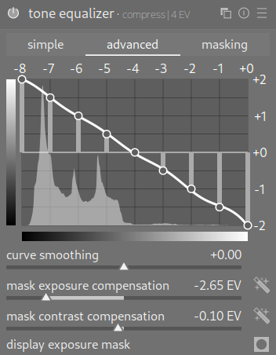
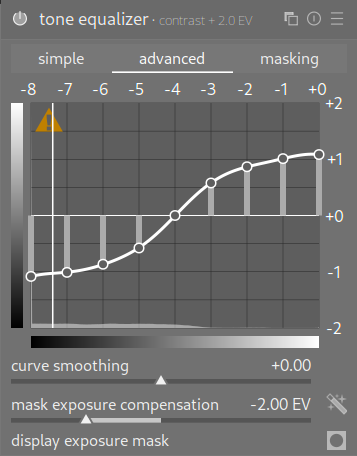
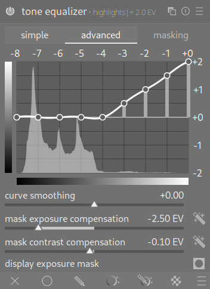
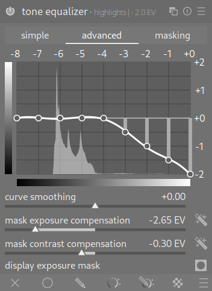
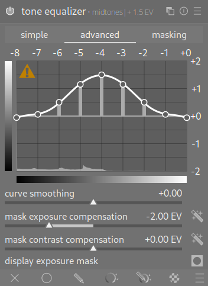
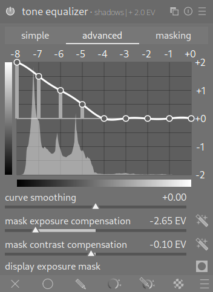
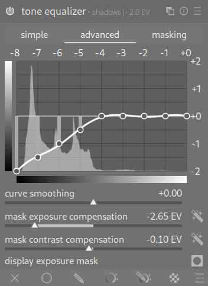

# darktable Tone Equalizer Preset Collection

Collection of useful tone equalizer presets for darktable. Includes presets for compression and contrast, for raising and lowering shadows and highlights and for raising midtones.

### Compression

### Contrast

### Highlights

 

### Midtones

### Shadows

 
